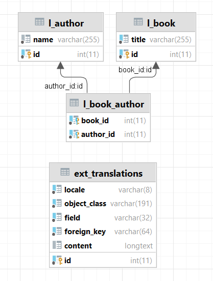

# Library REST sample
Пример кода, бибилиотека книг с взамодействием по API.

## Задание
Используя фреймворк Symfony 6, написать API для создания и получения книг и авторов из базы данных в формате JSON.

### Требования
- Формат запросов/ответов JSON
- Поддержка мультиязычности
- Docker контейнер
- Внести тестовые данные, по ~10 000 книг и авторов
- Реализовать создание книги и автора
- Реализовать получение книги и автора
- Реализовать получение списка книг с автороми из базы c поиском по названию книги
- Написать Unit-тест

### Сущности
Книга:
```json
{
  "id": 1,
  "title": "Название книги",
  "authors": [
    {
      "id": 1,
      "name": "Автор 1"
    },
    {
      "id": 2,
      "name": "Автор 2"
    }
  ]
}
```

Автор:
```json
{
  "id": 1,
  "name": "Автор 1",
  "books": [
    {
      "id": 1,
      "name": "Название книги 1"
    },
    {
      "id": 2,
      "name": "Название книги 2"
    }
  ]
}
```

## Комментарии
- Для мультиязычности
  используется [doctrine-extensions/DoctrineExtensions](https://github.com/doctrine-extensions/DoctrineExtensions)
- Для описания API используется [zircote/swagger-php](https://github.com/zircote/swagger-php)

## Структура БД


# Установка
## Первый запуск
1. Скопировать файл [.env.dist](./.env.dist) в .env и установить нужные настройки (см. комменты в файле)
2. Развернуть окружение [docker](https://www.docker.com/) командой
    ```bash
    docker-compose up -d --build
    ```
3. Установить composer-зависимости командой (при необходимости изменить library-php см. п.1):
     ```bash
     docker exec -it library-php composer install
     ```
4. Мигрировать БД командой (при необходимости изменить library-php см. п.1):
     ```bash
     docker exec -it library-php php bin/console d:m:m -q
     ```
5. Загрузить тестовый данные (при необходимости изменить library-php см. п.1):
     ```bash
     docker exec -it library-php php bin/console d:f:l -q --no-debug
     ```
6. По-умолчанию сервер будет доступен по адресу 127.0.0.1:8000

## Генерация документации по api
Сгенерировать документацию openapi 3.0:
```shell
docker exec -it library-php ./vendor/bin/openapi src -o openapi.yaml
```
Актуальную версию можно посмотреть [здесь](./docs/openapi.yaml).

## Тестирование
Запуск тестов:
```shell
docker exec -it library-php ./vendor/bin/phpunit
```

# Что можно добавить (ToDo)
1. Выделить переводы из общей в отдельные сущности, это увеличт скорость выдачи результатов
2. Добавить разбитие на страницы в выдачу списков (поиск), это уберет ограничение в 10 результатов в выдаче поиска
3. написать инструкции для production сборки докера
